# Criação da Vitrine Virtual

O projeto modelo será uma vitrine virtual. A ideia é criar um site que apenas exiba os produtos de uma loja. O site terá uma página inicial com a lista de produtos e uma página de detalhes de cada produto. Usuários registrados podem cadastrar novos produtos e editar produtos existentes. Haverá uma página de login e uma página de registro de novos usuários, bem como páginas para cadastrar, alterar e excluir produtos. Haverá também uma página para cadastrar fotos dos produtos. Para acompanhar este tutorial, é importante que você tenha uma instância do VSCode com o projeto pronto aberto para obter os arquvios estáticos que forem necessários ao longo do processo.

## Criar Estrutura de Pastas

```bash
- route
- static
- template
- util
```

## Extrair Arquivo `/static.zip`

Extraia o arquivo `static.zip` na pasta `/static` para obter os arquivos estáticos necessários para completar esse passo a passo. Ao fim, a pasta `/static` deve conter as seguintes pastas com seus respectivos arquivos:

```bash
- static
  - css
  - img
  - js
  - lib
```

## Criar Arquivo `/template/base.html`

```html
<!DOCTYPE html>
<html lang="pt-br">

<head>
    <meta charset="UTF-8">
    <meta name="viewport" content="width=device-width, initial-scale=1.0">
    <link rel="stylesheet" href="/static/lib/bootstrap/bootstrap.min.css">
    <link rel="stylesheet" href="/static/lib/bootstrap-icons/font/bootstrap-icons.min.css">
    <link rel="stylesheet" href="/static/css/estilos.css">
    <title>Vitrine Virtual :: </title>
</head>

<body class="d-flex flex-column min-vh-100">
    
    <main class="container my-3">
        
    </main>
    
    <script src="/static/lib/bootstrap/bootstrap.bundle.min.js"></script>
</body>

</html>
```

## Criar Arquivo `/template/include/header.html`

```html
<nav class="navbar navbar-expand-md navbar-dark bg-dark p-3">
    <div class="container">
        <a class="navbar-brand" href="/">Vitrine Virtual</a>
        <button class="navbar-toggler d-lg-none" type="button" data-bs-toggle="collapse" data-bs-target="#menuPrincipal">
            <span class="navbar-toggler-icon"></span>
        </button>
        <div class="collapse navbar-collapse" id="menuPrincipal">
            <ul class="navbar-nav me-auto">
                <li class="nav-item">
                    <a class="nav-link" href="/">Principal</a>
                </li>
                <li class="nav-item">
                    <a class="nav-link" href="/entrar">Entrar</a>
                </li>
                <li class="nav-item dropdown">
                    <a class="nav-link dropdown-toggle" href="/#" id="menuAreaRestrita" data-bs-toggle="dropdown">
                        Área Restrita</a>
                    <div class="dropdown-menu">
                        <a class="dropdown-item" href="/usuario/gerenciamento">Gerenciamento de Produtos</a>
                        <a class="dropdown-item" href="/usuario/sair">Sair</a>
                    </div>
                </li>
            </ul>
            <form class="d-flex" action="/buscar" method="get">
                <input class="form-control form-control-sm me-2" type="search" name="q" placeholder="Buscar..." required />
                <button class="btn btn-sm btn-danger" type="submit">
                    Buscar
                </button>
            </form>
        </div>
    </div>
</nav>
```

## Criar Arquivo `/template/include/footer.html`

```html
<footer class="bg-dark text-white text-center p-3 mt-auto">
    <p class="mb-0">Vitrine Virtual &reg;</p>
    <p class="mb-0">Copyright &copy; 2024</p>
    <p class="mb-0">Todos os direitos reservados</p>
</footer>
```

## Criar Arquivo `/template/index.html`

```html

Principal

<h1>Principal</h1>
<hr>
Aqui serão mostrados os produtos.

```

## Criar Arquivo `/route/main_routes.py`

```python
from fastapi import APIRouter, Request
from fastapi.templating import Jinja2Templates

router = APIRouter()
templates = Jinja2Templates(directory="template")

@router.get("/")
def get_root(request: Request):
    return templates.TemplateResponse("index.html", {"request": request})
```

## Criar Arquivo `/main.py`

```python
# main.py na raiz do projeto
from fastapi import FastAPI
from fastapi.staticfiles import StaticFiles
import uvicorn

from route.main_routes import router as main_router

# criação do objeto que representa a aplicação web
app = FastAPI()
# montagem do diretório de arquivos estáticos (css, js, imagens etc.)
app.mount(path="/static", app=StaticFiles(directory="static"), name="static")
# adição dos módulos de rotas
app.include_router(main_router)
# execução do servidor web
if __name__ == "__main__":
    uvicorn.run(app="main:app", port=8000, reload=True)
```

## Visualização da Página Principal

Execute o projeto a partir do arquivo `/main.py` e acesse o endereço `http://localhost:8000/` para visualizar a página raiz do projeto.

<p style="border: solid 2px gray; padding: 10px;">
  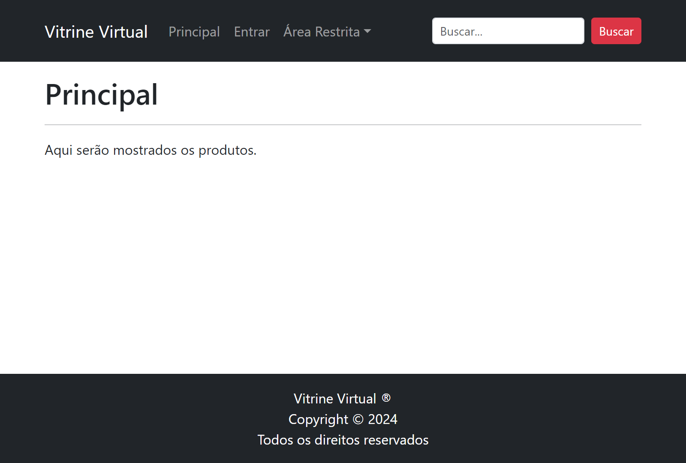
</p>

## Criar Arquivo `/template/include/grid_produtos.html`

```html
<div class="row row-cols-1 row-cols-md-3 row-cols-lg-4 row-cols-xxl-6 g-3">
    
    <div class="col">
        <div class="card h-100">
            
            <div class="card-body d-flex flex-column">
                <h5 class="card-title text-center">
                    {{ lipsum(n=1, html=False, min=4, max=5) }}
                </h5>
                <p class="card-text text-center texto-3-linhas">
                    {{ lipsum(n=1, html=False, min=20, max=21) }}
                </p>
                <p class="lead text-danger text-center mt-auto">
                    R$ {{ "{:,.2f}".format(14.99) }}
                </p>
                <p class="text-center mb-0">
                    <a href="/produto/{{i}}" class="btn btn-danger">
                        <i class="bi bi-search"></i>
                        Ver Detalhes
                    </a>
                </p>
            </div>
        </div>
    </div>
    
</div>
```

## Modificar Arquivo `/template/index.html`

Substitua todo o conteúdo do bloco `conteudo` por:

```html

```

## Visualização da Página Principal com Produtos

Apenas para fins de visualização neste documento, foram renderizados somente 3 produtos. No entanto, o arquivo `grid_produtos.html` renderiza 12 produtos. Para visualizar todos os produtos, basta alterar o valor de `range(1, 4)` para `range(1, 13)`.

<p style="border: solid 2px gray; padding: 10px;">
  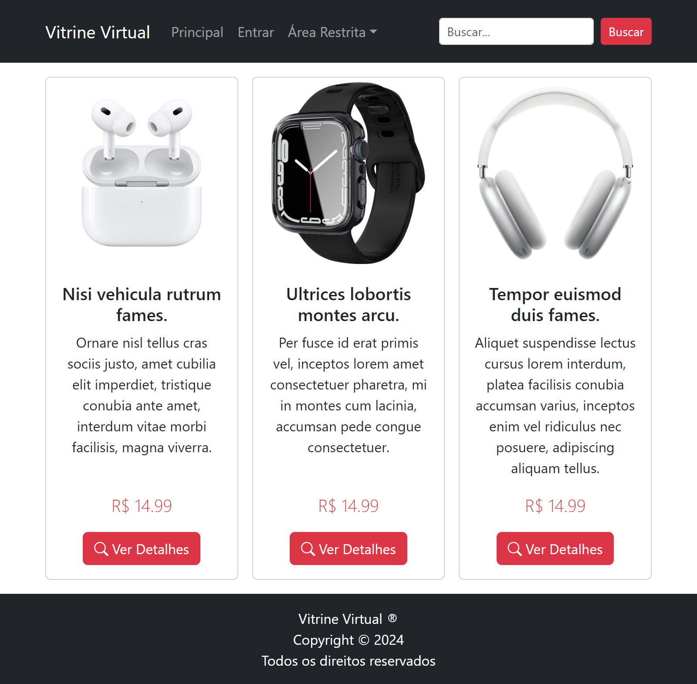
</p>

## Criar Arquivo `/template/entrar.html`

```html

Principal

<h1>Entrar</h1>
<hr>
<form action="/post_entrar" method="post" class="col-12 col-md-6 col-xl-5">
    <div class="form-floating mb-3">
        <input type="email" class="form-control" id="email" name="email" placeholder=" " required autofocus>
        <label for="email" class="form-label">E-mail</label>
    </div>
    <div class="form-floating mb-3">
        <input type="password" class="form-control" id="senha" name="senha" placeholder=" " required>
        <label for="senha" class="form-label">Senha</label>
    </div>
    <div class="mb-3">
        <button type="submit" class="btn btn-danger">Entrar</button>
    </div>
    <hr>
    <div>
        <p>Ainda não é cadastrado? Clique no botão abaixo para se cadastrar.</p>
        <a href="/cadastrar" class="btn btn-sm btn-outline-dark">Quero Me Cadastrar</a>
    </div>
</form>

```

## Adicionar ao Fim de `/route/main_routes.py`

```python 
@router.get("/entrar")
def get_login(request: Request):
    return templates.TemplateResponse("entrar.html", {"request": request})
```

## Visualização da Página de Entrada de Usuários

<p style="border: solid 2px gray; padding: 10px;">
  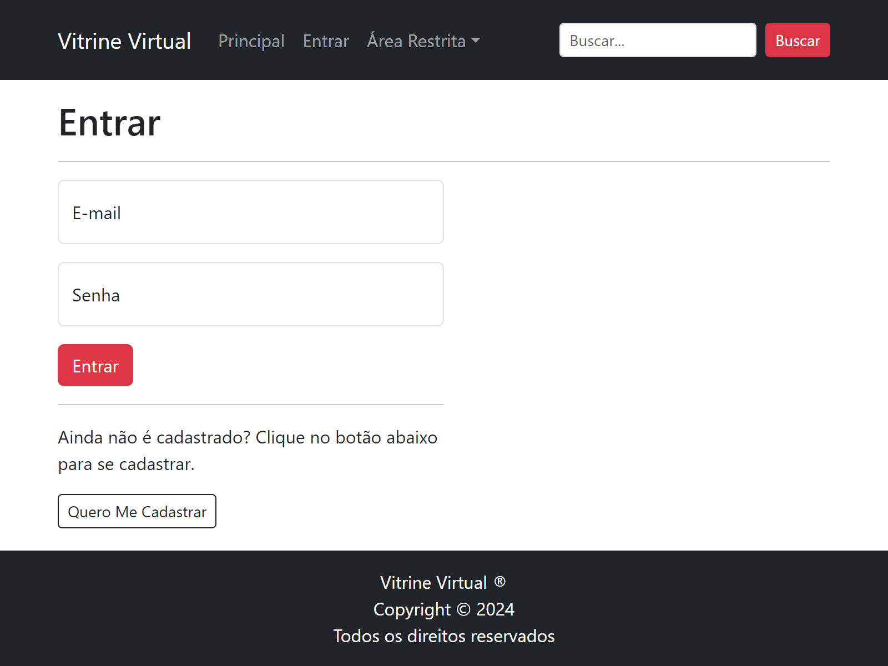
</p>

## Criar Arquivo `/template/include/mensagem.html`

Esse template parcial verifica se tem um cookie chamado `mensagem` na requisição atual e, se tiver, armazena seu valor na variável Jinja `mensagem`. Em seguida, exibe a mensagem usando um componente de alerta do Bootstrap. O alerta é exibido apenas uma vez, pois esse cookie sempre é configurado para expirar após 1 segundo no navegador do usuáriio.

```html




<div class="alert alert-info alert-dismissible fade show" role="alert">
    {{ mensagem|safe }}
    <button type="button" class="btn-close" data-bs-dismiss="alert" aria-label="Fechar"></button>
</div>

```

## Modificar Arquivo `/template/base.html`

Adicione uma linha acima de `` e digite o seguinte código:

```html

```

## Criar Arquivo `/util/cookies.py`

A função a seguir adiciona um cookie chamado `mensagem` com um tempo de vida de 1 segundo. O cookie é configurado para ser acessível apenas por HTTP e não por JavaScript (`httponlye=True`). O cookie também é configurado para ser acessível apenas pelo mesmo site (`samesite="lax"`) e não por sites de terceiros.

```python
from fastapi import Response

def adicionar_cookie_mensagem(response: Response, mensagem: str):
    response.set_cookie(
        key="mensagem",
        value=mensagem,
        max_age=1,
        httponly=True,
        samesite="lax",
    )    
```

## Modificar Arquivo `/route/main_routes.py`

No topo do arquivo, nas importações existentes, adicione manualmente a importação de `status` e `Form`:

```python
from fastapi import APIRouter, Request, Form, status
```

No topo do arquivo, após as importações existentes, adicione a importação da função `adicionar_cookie_mensagem`:

```python
from util.cookies import adicionar_cookie_mensagem
```

No fim do arquivo, adicione a rota de processamento do formulário de login:

```python
@router.post("/post_entrar")
async def post_entrar(request: Request, email: str = Form(...), senha: str = Form(...)):
    response = RedirectResponse("/", status_code=status.HTTP_302_FOUND)
    adicionar_cookie_mensagem(
        response, f"Entrada de usuário <b>{email}</b> realizada com sucesso!"
    )
    return response
```

A princípio, a função `post_entrar` apenas redireciona o usuário para a página principal. No entanto, ela também adiciona uma mensagem de sucesso na entrada do usuário, independentemente do usuário e senha que o usuário digitou. Mais adiante, modificaremos o método post_entrar para que ele realmente verifique as credenciais do usuário em um banco de dados.

## Visualização da Página de Principal com Mensagem

<p style="border: solid 2px gray; padding: 10px;">
    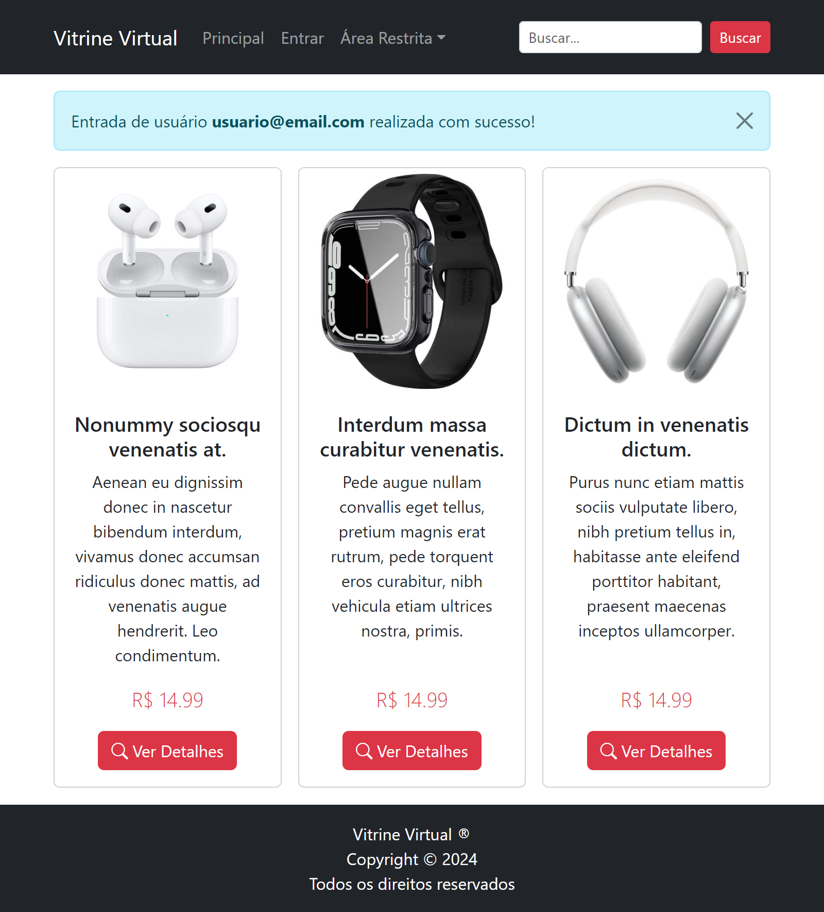
</p>

## Criar Arquivo `/template/cadastrar.html`

```html

Principal

<h1>Cadastro de Usuário</h1>
<hr>
<form action="/post_cadastrar" method="post" class="col-12 col-md-6 col-xl-5">
    <div class="form-floating mb-3">
        <input type="text" class="form-control" id="nome" name="nome" placeholder=" " required autofocus>
        <label for="nome" class="form-label">Nome</label>
    </div>
    <div class="form-floating mb-3">
        <input type="email" class="form-control" id="email" name="email" placeholder=" " required>
        <label for="email" class="form-label">E-mail</label>
    </div>
    <div class="form-floating mb-3">
        <input type="password" class="form-control" id="senha" name="senha" placeholder=" " required>
        <label for="senha" class="form-label">Senha</label>
    </div>
    <div class="form-floating mb-3">
        <input type="password" class="form-control" id="conf_senha" name="conf_senha" placeholder=" " required>
        <label for="conf_senha" class="form-label">Confirme a Senha</label>
    </div>
    <div class="mb-3">
        <button type="submit" class="btn btn-danger">Cadastrar</button>
    </div>
    <hr>
    <div>
        <p>Já é cadastrado? Clique no botão abaixo para entrar.</p>
        <a href="/entrar" class="btn btn-sm btn-outline-dark">Quero Entrar</a>
    </div>
</form>

```

## Modificar Arquivo `/route/main_routes.py`

Ao fim do arquivo, adicione a rota de exibição da página de cadastro de usuários:

```python
@router.get("/cadastrar")
def get_cadastrar(request: Request):
    return templates.TemplateResponse("cadastrar.html", {"request": request})
```

## Visualização da Página de Cadastro de Usuários

<p style="border: solid 2px gray; padding: 10px;">
    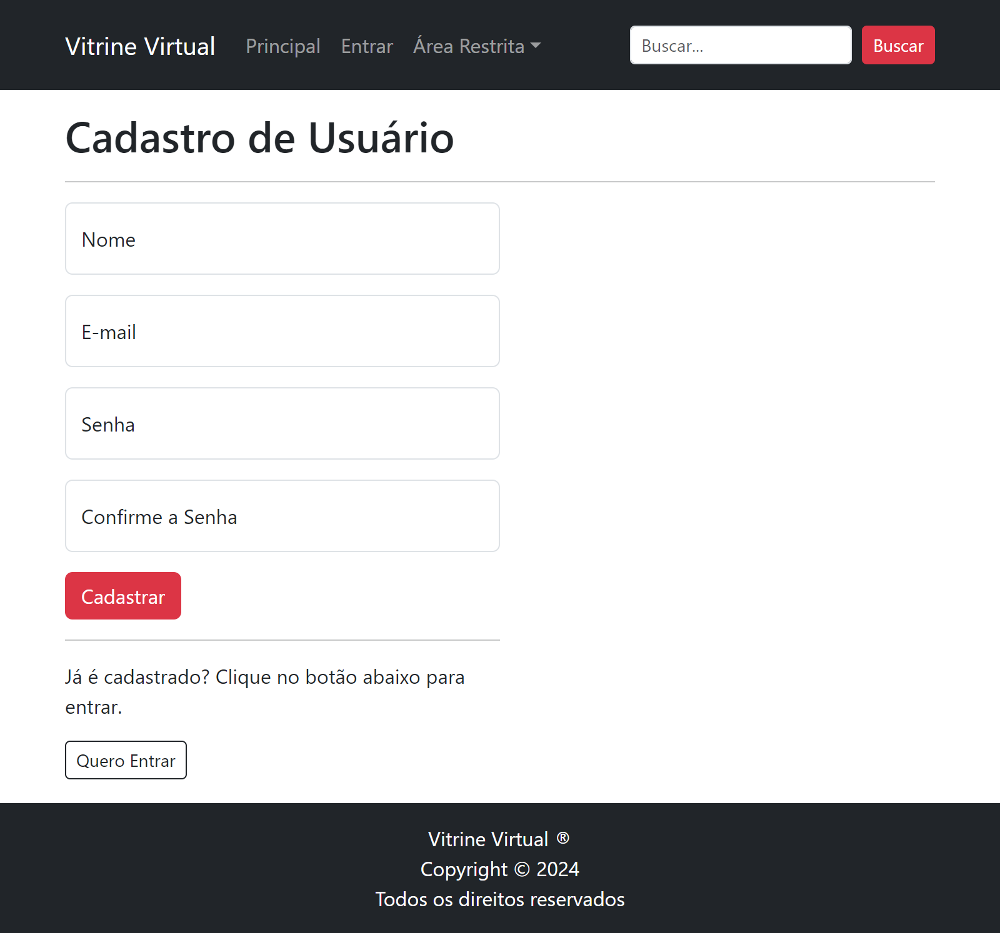
</p>

## Modificar Arquivo `/route/main_routes.py`

No topo do arquivo, após as importações existentes, adicione a importação de `RedirectResponse`:

```python
from fastapi.responses import RedirectResponse
```

Ao fim do arquivo, adicione a rota de processamento do formulário de cadastro de usuários:

```python
@router.post("/post_cadastrar")
async def post_cadastrar(request: Request, nome: str = Form(...), email: str = Form(...), senha: str = Form(...), conf_senha: str = Form(...)):
    response = RedirectResponse("/entrar", status_code=status.HTTP_302_FOUND)
    adicionar_cookie_mensagem(
        response, f"Usuário <b>{nome}</b> cadastrado com sucesso! Use suas credenciais para entrar."
    )
    return response
```

Por enquanto, a função `post_cadastrar` apenas redireciona o usuário para a página de entrada, adicionando uma mensagem indicando que o usuário foi cadastrado com sucesso. Mais adiante, modificaremos o método `post_cadastrar` para que ele realmente insira o usuário em um banco de dados.

## Visualização da Página de Entrada de Usuários com Mensagem

<p style="border: solid 2px gray; padding: 10px;">
    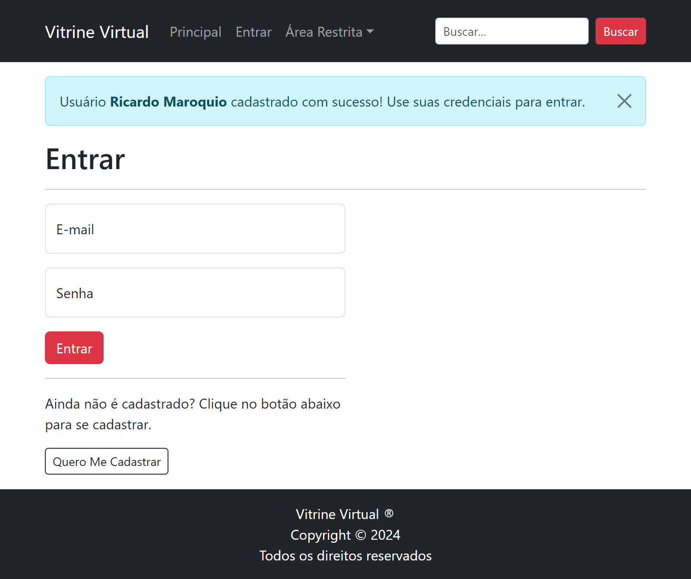
</p>

## Criar Arquivo `/template/produto.html`

```html

Detalhes do Produto {{ lipsum(1, False, 3, 4) }}

<h1>Detalhes de <b>{{ lipsum(1, False, 3, 4) }}</b></h1>
<hr>
<div class="row">
    <div class="col-4">
        
    </div>
    <div class="col-8">
        <ul class="nav nav-tabs">
            <li class="nav-item">
                <a class="nav-link text-dark active" href="#" data-bs-toggle="tab" data-bs-target="#divDescricao">Descrição</a>
            </li>
            <li class="nav-item">
                <a class="nav-link text-dark" href="#" data-bs-toggle="tab" data-bs-target="#divEspecs">Especificações Técnicas</a>
            </li>
            <li class="nav-item">
                <a class="nav-link text-dark" href="#" data-bs-toggle="tab" data-bs-target="#divGarantia">Garantia</a>
            </li>
        </ul>
        <div class="tab-content p-3 border border-top-0" id="tab-content">
            <div class="tab-pane active" id="divDescricao">
                {{ lipsum(1, False, 60, 70) }}
            </div>
            <div class="tab-pane" id="divEspecs">
                {{ lipsum(1, False, 60, 70) }}
            </div>
            <div class="tab-pane" id="divGarantia">
                Garantia legal de 90 dias contra defeitos de fabricação e garantia adicional de 9 meses oferecida pelo fabricante, totalizando 12 meses de garantia.
            </div>
        </div>
        <p></p>
        <p class="lead mb-0">
            <span class="small">De <s>R$ {{"{:,.2f}".format(14.99*1.1)}}</s></span>
        </p>
        <p class="lead">
            Por <b>R$ {{"{:,.2f}".format(14.99)}}</b>
        </p>
        <a href="/" class="btn btn-danger">
            Voltar à Principal
        </a>
    </div>
</div>

```

## Modificar Arquivo `/route/main_routes.py`

Ao fim do arquivo, adicione a rota de exibição da página de detalhes de produto:

```python
@router.get("/produto/{id}")
def get_produto(request: Request, id: int):
    return templates.TemplateResponse("produto.html", {"request": request})
```

## Visualização da Página de Detalhes de Produto

<p style="border: solid 2px gray; padding: 10px;">
    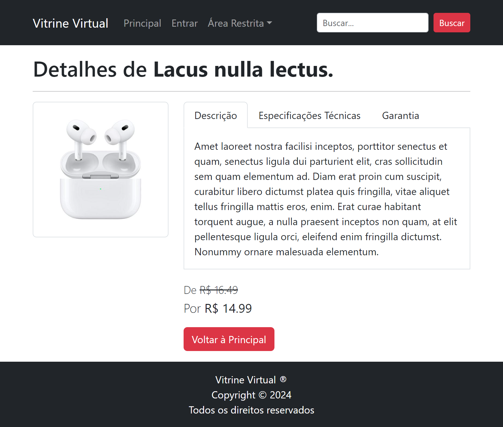
</p>

## Criar Arquivo `/template/buscar.html`

```html

Resultados da Busca por {{ "termo" }}

<h1>Resultados da Busca por <span class="text-danger">termo</span></h1>
<hr>


```

## Modificar Arquivo `/route/main_routes.py`

No topo do arquivo, nas importações existentes, acrescentar a importação de `Query`:

```python
from fastapi import APIRouter, Form, Query, Request, status
```

Ao fim do arquivo, adicione a rota de exibição da página de busca de produtos:

```python
@router.get("/buscar")
def get_buscar(request: Request, q: str = Query(...)):
    return templates.TemplateResponse("buscar.html", {"request": request, "termo": q})
```

## Visualização da Página de Busca de Produtos

Por enquanto, a página de busca de produtos exibe os mesmos produtos da página principal, passando o termo da busca para que o template exiba no título da página. Mais adiante, modificaremos a função `get_buscar` para que ela realmente busque produtos em um banco de dados.

<p style="border: solid 2px gray; padding: 10px;">
    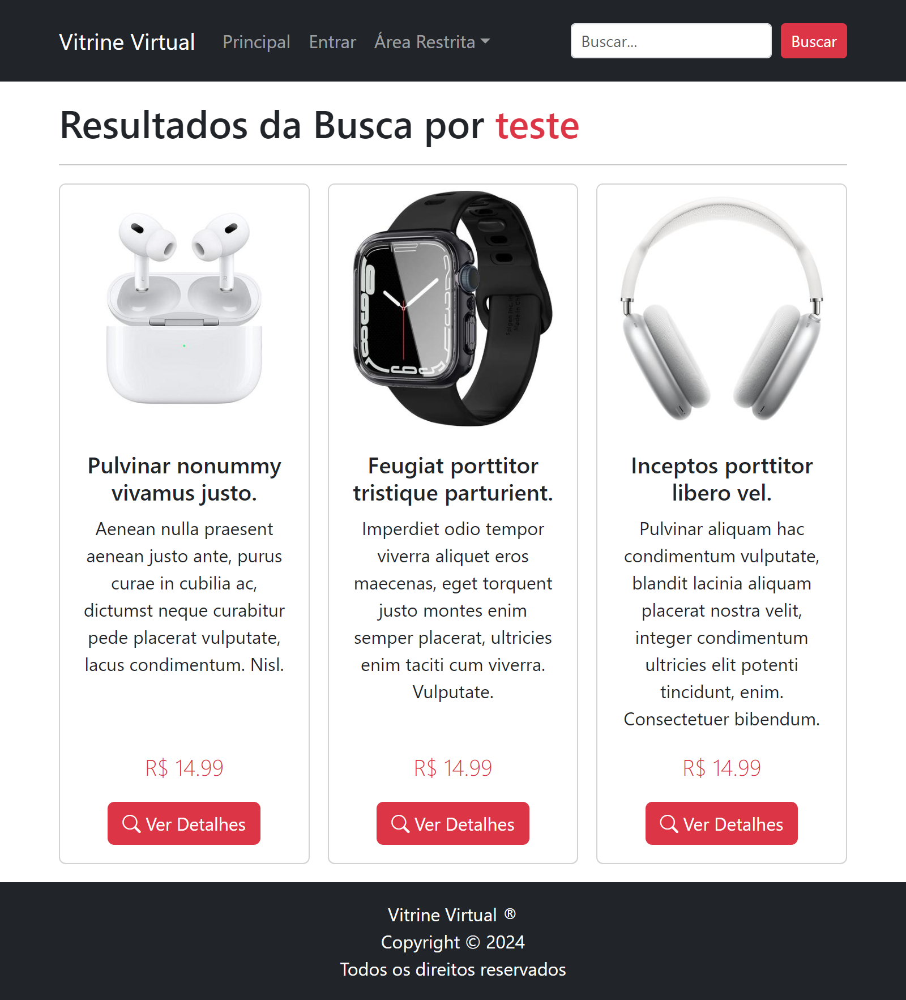
</p>

## Criar Arquivo `/template/gerenciamento.html`

```html

Gerenciamento de Produtos

<div class="d-flex justify-content-between align-items-center">
    <h1>Gerenciamento de Produtos</h1>
    <a href="/usuario/cadastrar_produto" class="btn btn-danger">Cadastrar Produto</a>
</div>
<hr>
<table class="table table-striped table-hover table-sm mb-0">
    <thead>
        <tr>
            <th>Foto</th>
            <th>Nome</th>
            <th>Preço</th>
            <th>Ações</th>
        </tr>
    </thead>
    <tbody>
        
        <tr>
            <td></td>
            <td>{{ lipsum(1, False, 3, 4) }}</td>
            <td>R$ {{ "{:,.2f}".format(14.99) }}</td>
            <td>
                <a href="/usuario/alterar_produto/{{ i }}" class="btn btn-primary btn-small">
                    <i class="bi bi-pencil"></i>
                </a>
                <a href="/usuario/excluir_produto/{{ i }}" class="btn btn-danger btn-small">
                    <i class="bi bi-trash"></i>
                </a>
            </td>
        </tr>
        
    </tbody>
</table>

```

## Criar Arquivo `/route/usuario_routes.py`

```python
from fastapi import APIRouter, File, Form, Request, UploadFile, status
from fastapi.responses import RedirectResponse
from fastapi.templating import Jinja2Templates
from util.cookies import adicionar_cookie_mensagem

router = APIRouter("/usuario")
templates = Jinja2Templates(directory="template")

@router.get("/gerenciamento")
def get_gerenciamento(request: Request):
    return templates.TemplateResponse("gerenciamento.html", {"request": request})
```

## Modificar Arquivo `/main.py`

No topo, após as importações existentes, adicione a importação do arquivo de rotas do usuário:

```python
from route.usuario_routes import router as usuario_router
```

Logo após a inclusão do módulo de rotas principal (`app.include_router(main_router)`), adicione o módulo de rotas do usuário:

```python
app.include_router(usuario_router)
```


## Visualização da Página de Gerenciamento de Produtos

<p style="border: solid 2px gray; padding: 10px;">
    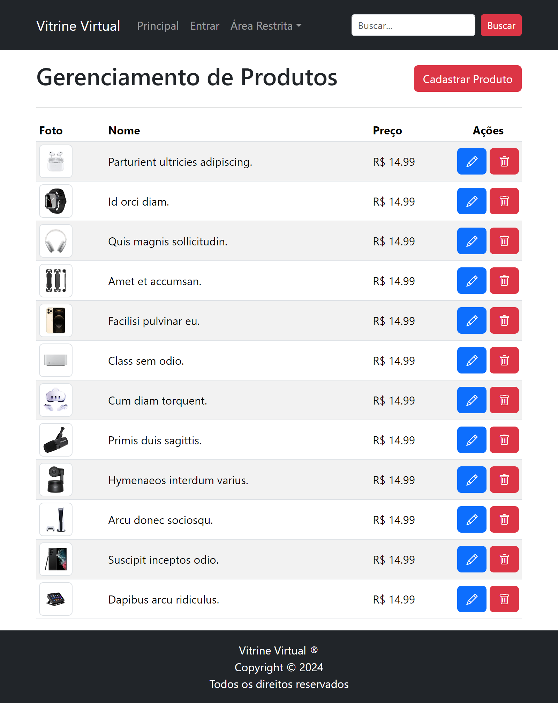
</p>

## Criar Arquivo `/template/cadastrar_produto.html`

```html

Cadastrar Produto

<h1>Cadastrar Produto</h1>
<hr>
<form action="/usuario/post_cadastrar_produto" method="post" class="col-12" enctype="multipart/form-data">
    <div class="form-floating mb-3">
        <input type="text" class="form-control" id="nome" name="nome" placeholder=" " required autofocus>
        <label for="nome" class="form-label">Nome</label>
    </div>
    <div class="form-floating mb-3">
        <textarea class="form-control" id="nome" name="descricao" placeholder=" " required style="height:120px"></textarea>
        <label for="descricao" class="form-label">Descrição</label>
    </div>
    <div class="form-floating mb-3">
        <input type="text" class="form-control" id="preco" name="preco" placeholder=" " required>
        <label for="preco" class="form-label">Preço</label>
    </div>
    <div class="w-100 mb-3">
        <label for="foto" class="form-label">Foto</label>
        <input type="file" class="form-control" id="foto" name="foto" onchange="previewImage(event)" accept="image/jpeg">
        
    </div>
    <div>
        <a href="/usuario/gerenciamento" class="btn btn-outline-dark me-1">Voltar</a>
        <button type="submit" class="btn btn-danger">Cadastrar</button>
    </div>
</form>
<script src="/static/js/previewImage.js"></script>

```

## Modificar Arquivo `/route/usuario_routes.py`

Ao fim do arquivo, adicione a rota de exibição da página de cadastro de produtos:

```python
@router.get("/cadastrar_produto")
def get_cadastrar_produto(request: Request):
    return templates.TemplateResponse("cadastrar_produto.html", {"request": request})
```

## Visualização da Página de Cadastro de Produtos

<p style="border: solid 2px gray; padding: 10px;">
    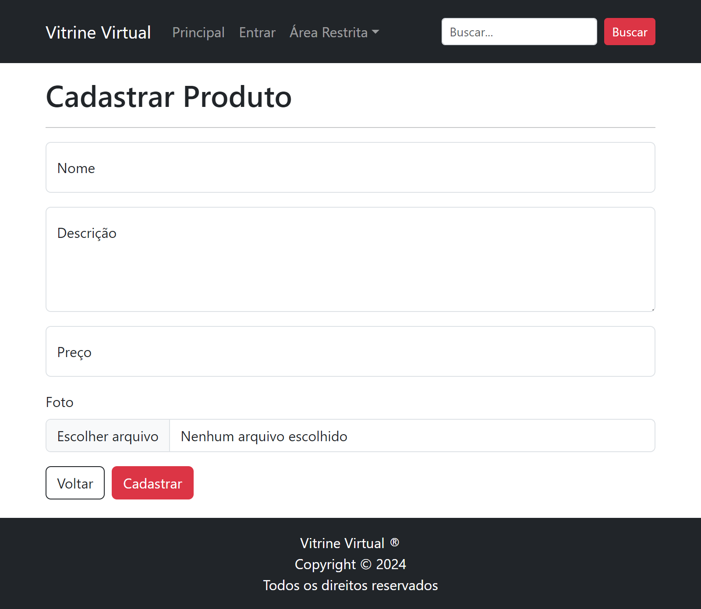
</p>

## Modificar Arquivo `/route/usuario_routes.py`

No topo do arquivo, nas importações existentes, adicione a importação de `File` e `UploadFile`:

```python
from fastapi import APIRouter, File, Form, Query, Request, UploadFile, status
```

Ao fim do arquivo, adicione a rota de processamento do formulário de cadastro de produtos:

```python
@router.post("/post_cadastrar_produto")
async def post_cadastrar_produto(request: Request, nome: str = Form(...), descricao: str = Form(...), preco: float = Form(...), foto: UploadFile = File(...)):
    response = RedirectResponse("/usuario/gerenciamento", status_code=status.HTTP_302_FOUND)
    adicionar_cookie_mensagem(
        response, f"Produto <b>{nome}</b> cadastrado com sucesso!"
    )
    return response
```

## Criar Arquivo `/template/alterar_produto.html`

```html

Alterar Produto

<h1>Alterar Produto</h1>
<hr>
<form action="/usuario/post_alterar_produto/{{ produto.id }}" method="post" class="col-12" enctype="multipart/form-data">
    <input type="hidden" name="id" value="{{ produto.id }}">
    <div class="form-floating mb-3">
        <input type="text" class="form-control" id="nome" name="nome" placeholder=" " required autofocus value="{{ produto.nome }}">
        <label for="nome" class="form-label">Nome</label>
    </div>
    <div class="form-floating mb-3">
        <textarea class="form-control" id="nome" name="descricao" placeholder=" " required style="height:120px">{{ produto.descricao }}</textarea>
        <label for="descricao" class="form-label">Descrição</label>
    </div>
    <div class="form-floating mb-3">
        <input type="text" class="form-control" id="preco" name="preco" placeholder=" " required value="{{ produto.preco }}">
        <label for="preco" class="form-label">Preço</label>
    </div>
    <div class="w-100 mb-3">
        <label for="foto" class="form-label">Foto</label>
        <input type="file" class="form-control" id="foto" name="foto" onchange="previewImage(event)" accept="image/jpeg">
        
    </div>
    <div>
        <a href="/usuario/gerenciamento" class="btn btn-outline-dark me-1">Voltar</a>
        <button type="submit" class="btn btn-danger">Alterar</button>
    </div>
</form>
<script src="/static/js/previewImage.js"></script>

```

## Modificar Arquivo `/route/usuario_routes.py`

Ao fim do arquivo, adicione a rota de exibição da página de alteração de produto:

```python
@router.get("/alterar_produto/{id}")
def get_alterar_produto(request: Request, id: int):
    return templates.TemplateResponse("alterar_produto.html", {"request": request, "id": id})
```

## Visualização da Página de Alteração de Produto

<p style="border: solid 2px gray; padding: 10px;">
    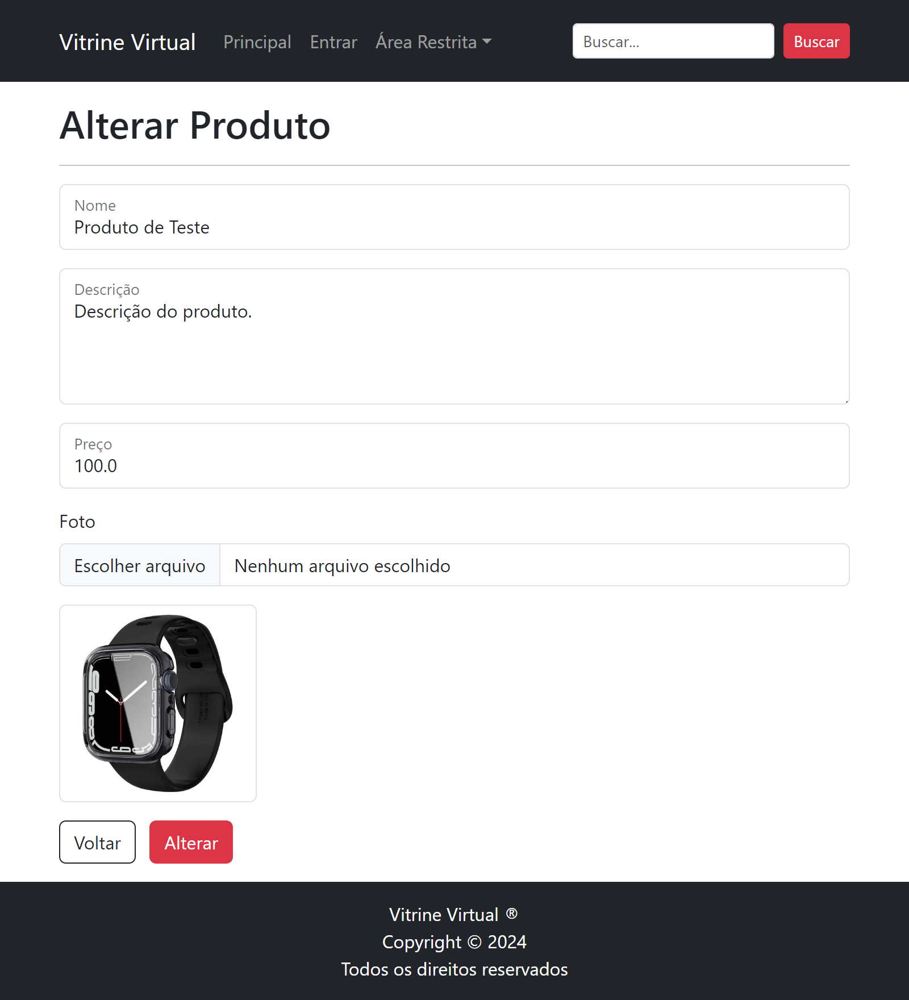
</p>

## Modificar Arquivo `/route/usuario_routes.py`

Ao fim do arquivo, adicione a rota de processamento do formulário de alteração de produto:

```python
@router.post("/usuario/post_alterar_produto/{id}")
async def post_alterar_produto(request: Request, id: int, nome: str = Form(...), descricao: str = Form(...), preco: float = Form(...), foto: UploadFile = File(...)):
    response = RedirectResponse("/usuario/gerenciamento", status_code=status.HTTP_302_FOUND)
    adicionar_cookie_mensagem(
        response, f"Produto <b>{nome}</b> alterado com sucesso!"
    )
    return response
```

## Criar Arquivo `/template/excluir_produto.html`

Nesta página, o usuário verá uma mensagem de confirmação antes de excluir o produto. Se o usuário confirmar a exclusão, o produto será excluído e o usuário será redirecionado para a página de gerenciamento de produtos.

```html

Excluir Produto

<h1>Excluir Produto</h1>
<hr>
<p>Tem certeza de que deseja excluir o produto <b>{{ produto.nome }}</b>?</p>
<form action="/usuario/post_excluir_produto/{{ produto.id }}" method="post" class="col-12">
    <input type="hidden" name="nome" value="{{ produto.nome }}">
    <div>
        <a href="/usuario/gerenciamento" class="btn btn-outline-dark">Cancelar</a>
        <button type="submit" class="btn btn-danger">Excluir</button>
    </div>
</form>

```

## Modificar Arquivo `/route/usuario_routes.py`

Ao fim do arquivo, adicione a rota de exibição da página de exclusão de produto:

```python
@router.get("/usuario/excluir_produto/{id}")
def get_excluir_produto(request: Request, id: int):
    return templates.TemplateResponse("excluir_produto.html", {"request": request, "id": id})
```

## Visualização da Página de Exclusão de Produto

<p style="border: solid 2px gray; padding: 10px;">
    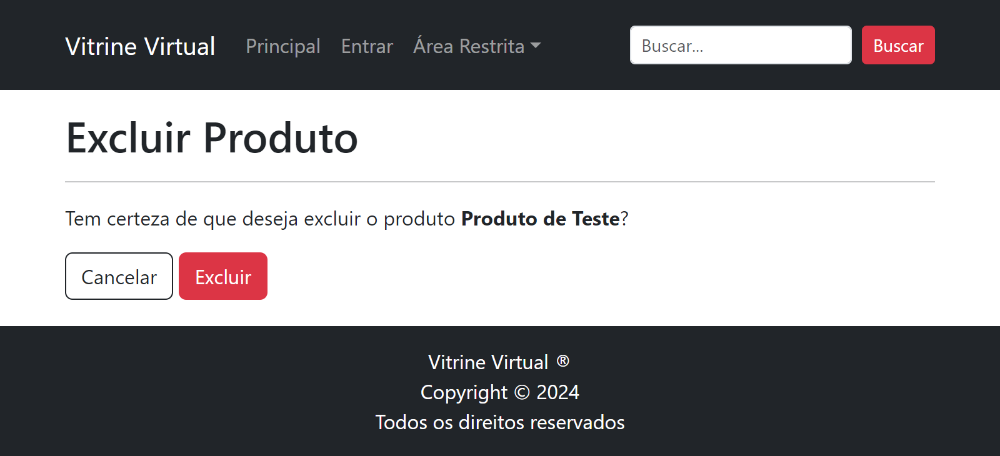
</p>

## Modificar Arquivo `/route/usuario_routes.py`

Ao fim do arquivo, adicione a rota de processamento do formulário de exclusão de produto:

```python
@router.post("/post_excluir_produto/{id}")
async def post_excluir_produto(request: Request, id: int, nome: str = Form(...)):
    response = RedirectResponse(
        "/usuario/gerenciamento", status_code=status.HTTP_302_FOUND
    )
    adicionar_cookie_mensagem(response, f"Produto <b>{nome}</b> excluído com sucesso!")
    return response
```

## Modificar Arquivo `/route/usuario_routes.py`

Ao fim do arquivo, adicione a rota de saída do usuário:

```python
@router.get("/sair")
def get_sair(request: Request):
    response = RedirectResponse("/", status_code=status.HTTP_302_FOUND)    
    return response
```